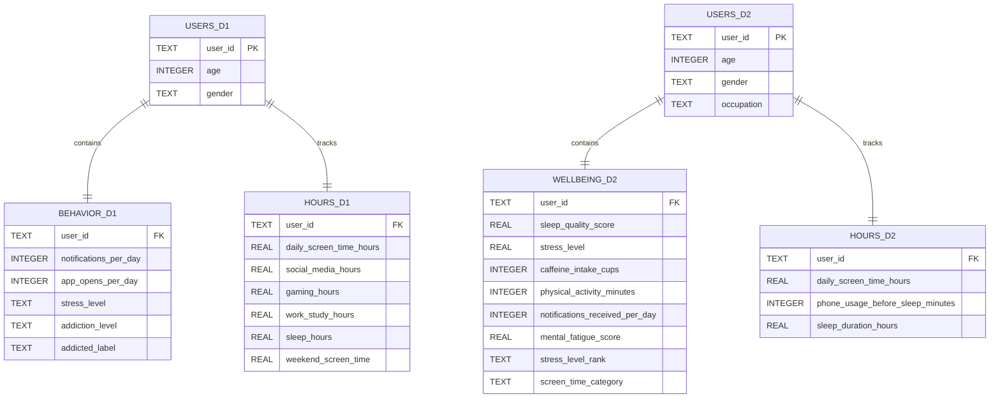

# Smartphone Addiction Analysis

Is there a direct correlation between the amount of notifications someone gets per day and their self reported smartphone addiction level?


## Author

- [@BugBananaLiver](https://www.github.com/BugBananaLiver)

## Sources

**Smartphone_Usage_And_Addiction** 
*Kaggle -https://www.kaggle.com/datasets/zahranusratt/smartphone-usage-and-addiction-analysis-dataset*


**Sleep_mobile_stress_dataset**
*Kaggle -https://www.kaggle.com/datasets/jayjoshi37/sleep-screen-time-and-stress-analysis*
 

## Project Scope

This project analyzes two independent smartphone usage datasets using Python, Pandas, SQLite, and SQL. Each dataset was cleaned, explored, and normalized into multiple related tables to reduce redundancy and improve organization. The cleaned data was then imported into a SQLite database where SQL queries were used to answer analytical questions and uncover trends.

Although the datasets contain similar information, they represent different groups of users and therefore were analyzed independently. Instead of combining unrelated records, the project compares overall trends and differences between the datasets while using SQL joins within each dataset to connect demographic information with smartphone usage, sleep, stress, and wellbeing data.

The goal of this project is to demonstrate the complete data analysis process, from cleaning raw data and designing a relational database to querying and visualizing meaningful results. The findings illustrate how demographic characteristics and smartphone usage patterns could help organizations identify groups that may benefit from digital wellbeing initiatives, sleep awareness campaigns, or workplace wellness programs. While the datasets are synthetic and do not establish cause-and-effect relationships, they provide a realistic environment for practicing data analysis, database design, and SQL development.


## Entity Relationship Diagram (ERD)



## 3 Original Python Functions

1.  Show all 3-min, average, and max- of a numerical column when grouped by a string column. Created while cleaning 2nd dataset.
    ```
    def summary_by_group(df, group_col, value_col):
        return df.groupby(group_col)[value_col].agg(['min','mean', 'max'])
2.  Create a column that categorizes the numerical amount of screen time hours into a string described by low, moderate, and high for easier readability.
    ```
    def screen_time_category(hours):

            if hours < 3:
                return "Low"
            elif hours < 6:
                return "Moderate"
            else:
                return "High"
## FAQ

#### Is the DataSet synthetic or organic?

    The DataSet was synthetically created to represent phone usage. This is not organic data.

#### How many hours went into the creation of this project?

    As of May 17 2026, roughly 34 hours have gone into this project.

    As of July 8 2026, roughly 51 hours have gone into this project.

    As of July 13 2026, roughly 62 hours have gone into this project.

#### Why didn't you join the two datasets together?

    Although both datasets contain similar information, they represent different groups of users. Joining them by user_id would create relationships that do not exist. Instead, I have created a relational database that allows for comparisons between the datasets using summary statistics, while joins were only used within each dataset where the tables shared the same users. 

#### Did you use AI assistance?

    Yes, portions of this project were completed with the assistance of OpenAI's ChatGTP (GPT-5.5). ChatGPT was used to explain programming concepts, debug Python and SQL code errorss, and improve project documentaion. All code, analyses, and written explanations were reviewed, understood, and modified by the author.

#### Which Python libraries did you use?

    1. PANDAS
    2. Matplotlib
    3. Numpy
    4. Seaborn
    5. SQLite3


## Related files
1. Smartphone_Usage_And_Addiction.csv 
2. Data_Cleanup.ipynb
3. cleaned_smartphone_usage_and_addiction.csv
4. sleep_mobile_stress_dataset_15000.csv
5. Data_Cleanup_2nd.ipynb
6. cleaned_sleep_mobile_stress_dataset_15000.csv
7. Smartphone.db
8. Smartphone_Database.SQL.ipynb
9. requirements.txt
10. README.md