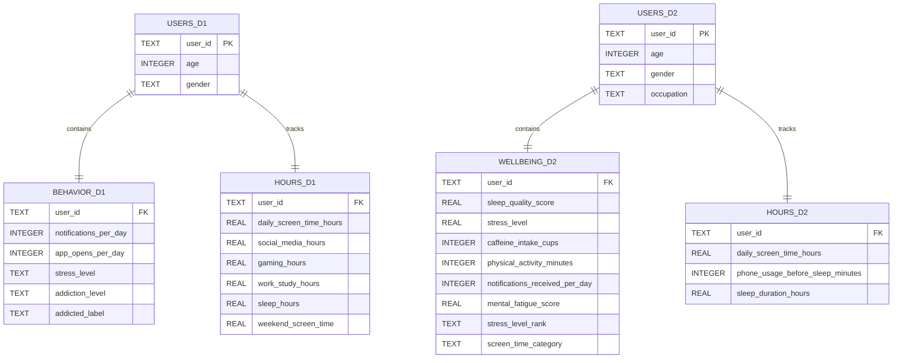

# Smartphone Addiction Analysis

Is there a direct correlation between the amount of notifications someone gets per day and their self reported smartphone addiction level?

## Authors

- [@BugBananaLiver](https://www.github.com/BugBananaLiver)

## Sources

**Smartphone_Usage_And_Addiction** 
*Kaggle -https://www.kaggle.com/datasets/zahranusratt/smartphone-usage-and-addiction-analysis-dataset*

**Sleep_mobile_stress_dataset**
*Kaggle -https://www.kaggle.com/datasets/jayjoshi37/sleep-screen-time-and-stress-analysis*
 

## Content

The datasets come from different studies and do not contain the same participants. Rather than joining individuals across datasets,  this project integrates both datasets into a single relational database and compares patterns in smartphone use, stress, addiction, and sleep across the two populations. 

## Entity Relationship Diagram (ERD)

## FAQ

#### Is the DataSet synthetic or organic?

    The DataSet was synthetically created to represent phone usage. This is not organic data.

#### How many hours went into the creation of this project?

    As of May 17 2026, roughly 34 hours have gone into this project.

    As of July 8 2026, roughly 51 hours have gone into this project.

    As of July 13 2026, roughly 62 hours have gone into this project.
