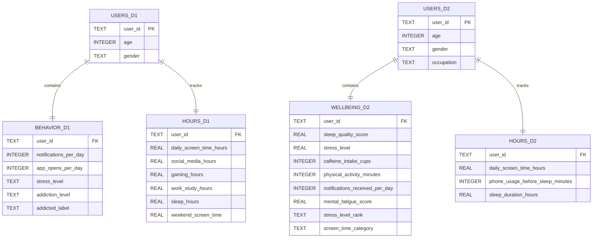

# Smartphone Addiction Analysis

## Author

- [@BugBananaLiver](https://www.github.com/BugBananaLiver)
## Project Overview
Which groups exhibit the highest smartphone usage patterns and how might these findings inform digital wellbeing initiatives?

## Project Scope

This project analyzes two independent smartphone usage datasets using Python, Pandas, SQLite, and SQL. Each dataset was cleaned, explored, and normalized into multiple related tables (Users, Wellbeing, Behavior, and Hours) to reduce redundancy and improve organization. The cleaned data was then imported into a SQLite database where SQL queries were used to answer analytical questions, uncover trends and joins were used to reconnect the data.

Although the datasets contain similar information, they represent different groups of users and therefore were analyzed independently. Instead of combining unrelated records, the project compares overall trends and differences between the datasets while using SQL joins within each dataset to connect demographic information with smartphone usage, sleep, stress, and wellbeing data.

The goal of this project is to demonstrate the complete data analysis process, from cleaning raw data and designing a relational database to querying and visualizing meaningful results. The findings illustrate how demographic characteristics and smartphone usage patterns could help organizations identify groups that may benefit from digital wellbeing initiatives, sleep awareness campaigns, or workplace wellness programs. While the datasets are synthetic and do not establish cause-and-effect relationships, they provide a realistic environment for practicing data analysis, database design, and SQL development.

## Key Findings
1. **Age group vs. average screen time** Finding: Younger users (students/young adults) had the highest average screen time.
2. **Occupation vs. average screen time and notifications** Findings: Students ranked highest for both metrics, although differences between occupations were all relatively small, suggesting occupation alone was not a strong predictor of smartphone use in this dataset.
3. **Users above the average screen time** Findings: A portion of users exceeded the overall average, suggesting that many individuals could benefit from education about healthy smartphone habits.


## Entity Relationship Diagram (ERD)




## Project Structure
| File | Description|
|------|------------|
|
`Smartphone_Usage_And_Addiction.csv`| Original data file|
|
`Data_Cleanup.ipynb`| Cleans and processes original dataset|
|
`cleaned_smartphone_usage_and_addiction.csv`| Cleaned version of the original dataset|
|
`sleep_mobile_stress_dataset_15000.csv`| Second original data file|
|
`Data_Cleanup_2nd.ipynb`|Cleans and processes second original dataset|
|
`cleaned_sleep_mobile_stress_dataset_15000.csv`|Cleaned version of the second dataset|
|
`Smartphone_Database.SQL.ipynb`|Creates SQLite database, performns SQL queries, and analyzes results|
|
`requirements.txt`|Lists the python packages required to run the project|
|
`README.md`|Documentation describing the project, setup instructions, and findings|


## Installation

### 1. Clone the repository
**Windows**
```bash
git clone
https://github.com/BugBananaLiver/Smartphone_Addiction_Analysis.git
cd Smartphone_Addiction_Analysis
```
**macOS/Linux**
```bash
git clone
https://github.com/BugBananaLiver/Smartphone_Addiction_Analysis.git
cd Smartphone_Addiction_Analysis
```

### 2. Create a virtual environment
**Windows**
```bash
python -m venv venv
```

**macOS/Linux**
```bash
python3 -m venv venv
```

### 3. Activate the virtual environment
**Windows (Command Prompt)**
```bash
venv\Scripts\activate
```
**Windows (PowerShell)**
```powershell
.\venv\Scripts\Activate.ps1
```
**macOS/Linux**
```bash
source venv/bin/activate
```
### 4. Install dependencies

**Windows, macOS, Linux**
```bash
pip install - r requirements.txt
```
### 5. Run the project
Open the notebooks in VS Code or Jupyter Notebook and run them in this order:
1. `Data_Cleanup.ipynb`
2. `Data_Cleanup_2nd.ipynb`
3. `Smartphone_Database_SQL.ipynb`

### 6.Deactivate the virtual environment
```bash
deactivate
```

## Sources

**Smartphone_Usage_And_Addiction** 
*Kaggle -https://www.kaggle.com/datasets/zahranusratt/smartphone-usage-and-addiction-analysis-dataset*


**Sleep_mobile_stress_dataset**
*Kaggle -https://www.kaggle.com/datasets/jayjoshi37/sleep-screen-time-and-stress-analysis*


## FAQ

#### Are the DataSets synthetic or collected?

    Both DataSets were synthetically created by another user to represent phone usage and stress factors. This is not organic data.

#### How many hours went into the creation of this project?

   May 17 2026, roughly 34 hours.
   July 8 2026, roughly 51 hours.
   July 13 2026, roughly 62 hours.
   July 20 2026, roughly 69 hours.
   July 21 2026, roughly 74 hours. Project Completion.

#### Why didn't you join the two datasets together?

    Although both datasets contain similar information, they represent different groups of users. Joining them by user_id would create relationships that do not exist. Instead, I have created a relational database that allows for comparisons between the datasets using summary statistics, while joins were only used within each dataset where the tables shared the same users. 

#### Did you use AI assistance?

    Yes, portions of this project were completed with the assistance of OpenAI's ChatGTP (GPT-5.5). ChatGPT was used to explain programming concepts, debug Python and SQL code errorss, and improve project documentaion. All code, analyses, and written explanations were reviewed, understood, and modified by the author. AI was a useful partner for better understanding and excuting the structure of the project.

#### Which technologies did you use?

    Python
    SQL
    PANDAS
    Matplotlib
    Numpy
    Seaborn
    SQLite3
    Jupyter Notebook
    Visual Studio Code
    Git
    GitHub
    
